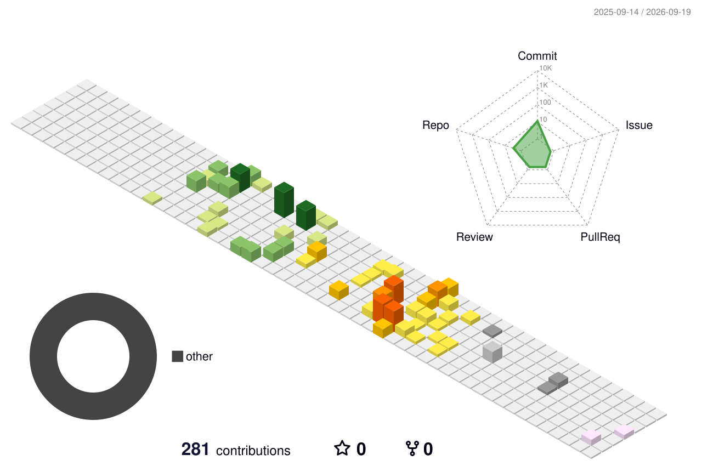

## 이력
2023 | DeepDynamic.me ( 딥다이나믹 ) 공동 설립  
2023 | 경기도 창업지원프로젝트 (우수상) 수상  
2026 | (MXSH) - 러스트로 작성된 AI 기반 명령어 필터링 및 범용 셸 개발 (https://mxsh.net)  
2026 | 한국지식재산연구학회(KOSIPER) 최우수논문, 지식재산처장상. (26.04.24)  
2026 | 대학교 창업동아리에서 시작한 회사인 딥 다이나믹을 딥 다이나믹 (주)로 전환  
2026 | 서준혁(@mireso) 및 신지한(@SHINJIHAN)과 함께하는 딥 다이나믹 주식회사의 서비스 개인용 PC, SBC 및 서버를 호스팅하는 DeepDynamic Colocation Service가 베타 버전을 종료하고 공식 서비스로 전환되었습니다.

## 보유 저작권
C-2026-009622 | MXSH(엠엑스셸) : 러스트로 작성된 AI 기반 명령어 필터링 및 범용 셸 개발 코드 저작권  
C-2026-005796 | NextAttention(넥스트 어텐션) : 인공지능 추론 코드 저작권 
